<div align="center">
  
</div>

<p align="center">
  <a href="https://shreyasbagal.in/"></a>
  
  
  
  
</p>

<br>

## What this is

The source of [**shreyasbagal.in**](https://shreyasbagal.in/) — the website of **Webbloom Digital**, a Pune-based digital marketing agency co-founded by Shreyas Bagal. The site is a static HTML build optimised for **traditional Google SEO**, **AEO** (answer engines like featured snippets), and **GEO** (Generative Engine Optimisation — being cited inside ChatGPT, Claude, Perplexity, Gemini, and Google AI Overviews).

Every public-facing number on this site is **screenshot-verifiable inside platform-native dashboards** (Meta Ads Manager, LinkedIn analytics, Instagram Insights, Google Business Profile). No marketing fiction.

<br>

<div align="center">
  
</div>

<br>

## Highlights

```text
✓  19 HTML pages           ✓  5 service pages         ✓  3 case studies
✓  3 Pune-area locations   ✓  52 JSON-LD schema blocks (validated, 0 errors)
✓  16 AI crawlers allowed  ✓  llms.txt + llms-full.txt deployed
✓  71 FAQPage Q&As         ✓  20,175 words of unique content
✓  894 fact-density tokens ✓  100% mobile-responsive
✓  Lighthouse-friendly     ✓  0 broken internal links
```

<br>

## Site architecture

<div align="center">
  
</div>

<br>

### Sitemap (Mermaid)

```mermaid
flowchart TD
    H((Home<br/>index.html)):::root --> R[Results<br/>results.html]:::root
    H --> A[About<br/>about.html]:::root
    H --> C[Contact<br/>contact.html]:::root

    H --> S{Services}:::svc
    S --> S1[Meta Ads Pune]:::svc
    S --> S2[SEO Services Pune]:::svc
    S --> S3[Social Media Pune]:::svc
    S --> S4[Reels &amp; Short-form]:::svc
    S --> S5[Personal Branding]:::svc

    H --> CS{Case Studies}:::cs
    CS --> CS1[Painex Clinic<br/>742K IG views]:::cs
    CS --> CS2[Kirti Associates<br/>+155.9% LinkedIn]:::cs
    CS --> CS3[Silver Horse<br/>#59 → top 5]:::cs

    H --> L{Locations}:::loc
    L --> L1[Kothrud]:::loc
    L --> L2[Hadapsar]:::loc
    L --> L3[Hinjewadi IT Corridor]:::loc

    H --> B{Blog / Insights}:::blog
    B --> B1[How to choose an agency]:::blog
    B --> B2[Meta Ads CPL India]:::blog
    B --> B3[Local SEO &amp; GBP]:::blog
    B --> B4[Reels strategy]:::blog

    classDef root fill:#1a1612,color:#fbf7ef,stroke:#0e0c0a,stroke-width:2px;
    classDef svc fill:#0f6b58,color:#fbf7ef,stroke:#0a4d3f,stroke-width:2px;
    classDef cs fill:#c2410c,color:#fbf7ef,stroke:#9a3208,stroke-width:2px;
    classDef loc fill:#1a9077,color:#fbf7ef,stroke:#0a4d3f,stroke-width:2px;
    classDef blog fill:#a87b3e,color:#fbf7ef,stroke:#7a5a2c,stroke-width:2px;
```



<br>

## Tech stack

```
[ HTML5 ] ─── [ CSS3 ] ─── [ Vanilla JS ]
    │             │              │
    └────── No framework. No build step. ──────┘
                       │
                   Just files.
```

| Layer | Choice | Why |
| ----- | ------ | --- |
| Markup | Static HTML5 | Maximum AI-crawler compatibility, zero JS dependency for content |
| Styling | Hand-rolled CSS, shared `pages.css` | No Tailwind bundle weight; lean cream + emerald + accent palette |
| Type | Fraunces (serif) + Inter (sans) + JetBrains Mono (numbers) | Google Fonts, `preconnect` optimised |
| Interactivity | Vanilla JS (no React/Vue) | Tab switcher on `results.html`, sticky nav, mobile burger menu |
| Hosting | GitHub Pages + custom domain via `CNAME` | Free, fast, immutable per-commit |
| Analytics | Google Analytics 4 | Standard GA tag, anonymised IP |
| Schema | JSON-LD inline per page | 52 blocks · 10 distinct `@type` values |

<br>

## Folder structure

```
Webbloom_Deploy/
├── CNAME                                       — points GitHub Pages to shreyasbagal.in
├── index.html                                  — homepage (+ LocalBusiness + 10-Q FAQ schema)
├── results.html                                — Tab 01 Meta Ads · Tab 02 LinkedIn (the credibility deck)
├── about.html                                  — Person + ProfilePage schema
├── contact.html                                — ContactPage + form (form → /thank-you.html)
├── thank-you.html                              — noindex confirmation
│
├── pages.css                                   — shared stylesheet for all new pages
├── sitemap.xml                                 — 19 URLs, priority-tiered
├── robots.txt                                  — 16 AI crawlers explicitly allowed
├── llms.txt                                    — top-level AI knowledge file (~7 KB)
├── llms-full.txt                               — deep AI knowledge file (~17 KB)
│
├── services/                                   — 5 Service pages (Service + LocalBusiness + FAQ schema)
│   ├── meta-ads-pune.html
│   ├── seo-services-pune.html
│   ├── social-media-management-pune.html
│   ├── reels-content-strategy-pune.html
│   └── personal-branding-pune.html
│
├── case-studies/                               — 3 Case studies (Article schema, real numbers)
│   ├── painex-clinic.html                      —   742K Instagram views / 3 months
│   ├── kirti-associates.html                   —   +155.9% LinkedIn members reached
│   └── silver-horse-ventures.html              —   Local pack #59 → top 5 in 60 days
│
├── locations/                                  — 3 Pune-area location pages (LocalBusiness schema)
│   ├── digital-marketing-agency-kothrud.html
│   ├── digital-marketing-agency-hadapsar.html
│   └── digital-marketing-agency-hinjewadi.html
│
├── blog/                                       — Existing insights articles (Article schema)
│   ├── blog.css
│   ├── digital-marketing-agency-pune.html
│   ├── meta-ads-cost-per-lead-india.html
│   ├── local-seo-google-business-profile.html
│   └── reels-content-strategy.html
│
└── .github/
    └── assets/                                 — SVG assets for this README only (not deployed)
        ├── banner.svg
        ├── architecture.svg
        └── geo-score.svg
```

> **Note:** the `off-site-seo/` folder, if present, holds copy-paste drafts for Reddit / Quora / Wikipedia / trade press / podcasts. It is **not** part of the deployable site. Add it to `.gitignore` or rename to `_off-site-seo/` to exclude from GitHub Pages.

<br>

## SEO / AEO / GEO infrastructure

This site is engineered for the post-Google-only search landscape. AI-referred traffic is up ~527% YoY and converts ~4.4× higher than organic clicks — only ~23% of marketers are investing in this surface area. We are.

| Lever | Implementation | File(s) |
| ----- | -------------- | ------- |
| **Traditional SEO** | Canonical tags, mobile viewport, sitemap, internal linking, keyword targeting | every page |
| **AEO** (answer engines) | Quick-Answer boxes (134–167-word self-contained passages), FAQPage schema with 71 Q&As, direct-answer paragraph structure | service pages, case studies, homepage |
| **GEO** (generative engines) | `llms.txt`, `llms-full.txt`, 16 AI crawlers explicitly allowed, schema beyond basics, entity-rich author bios | `llms.txt`, `llms-full.txt`, `robots.txt` |
| **Local SEO** | LocalBusiness JSON-LD with geo coordinates, areaServed array of 9 Pune neighbourhoods, aggregateRating, OpeningHoursSpecification, hasOfferCatalog | `index.html` + every location page |
| **Schema depth** | 52 JSON-LD blocks, 10 distinct `@type` values across 19 pages | inline per page |

### AI crawlers explicitly allowed

```
GPTBot · ChatGPT-User · OAI-SearchBot                — OpenAI / ChatGPT
ClaudeBot · anthropic-ai · Claude-Web                — Anthropic / Claude
PerplexityBot · Perplexity-User                      — Perplexity
Google-Extended                                       — Google AI Overviews / Gemini
Applebot-Extended                                     — Apple Intelligence
FacebookBot · Meta-ExternalAgent                     — Meta AI
Bytespider                                            — ByteDance
cohere-ai · AI2Bot · CCBot                           — Cohere · Allen AI · Common Crawl
```

### Schema types deployed

| `@type` | Count | Where |
| ------- | ----- | ----- |
| `BreadcrumbList` | 14 | every new page |
| `FAQPage` | 11 | homepage + every service page |
| `LocalBusiness` | 11 | homepage + service + location pages |
| `Service` | 5 | service pages |
| `BlogPosting` | 4 | existing blog articles |
| `Article` | 3 | case studies |
| `ProfilePage` | 1 | homepage |
| `Report` | 1 | results.html |
| `AboutPage` | 1 | about.html |
| `ContactPage` | 1 | contact.html |

<br>

## Local development

No build step. Open any HTML file directly in a browser, or serve the folder with a tiny static server.

```bash
# Clone
git clone https://github.com/<your-username>/<this-repo>.git
cd <this-repo>

# Option A — Python (built-in, fastest)
python3 -m http.server 8000
#  open http://localhost:8000/

# Option B — Node (if you have npx)
npx serve -p 8000
```

That's it. Edit any `.html`, save, reload. No bundler, no watcher, no node_modules.

<br>

## Deployment

GitHub Pages serves this repo directly. Workflow:

```bash
# Make changes...
git add .
git commit -m "Update <whatever>"
git push origin main
# Wait ~1–3 minutes for Pages to rebuild
```

The `CNAME` file at the repo root tells GitHub Pages to serve at `shreyasbagal.in`. DNS records for the domain point at GitHub Pages IPs — no further configuration needed once that's set up.

### Verification after deploy

```bash
curl -sI https://shreyasbagal.in/sitemap.xml   | grep HTTP   #  expect 200
curl -s  https://shreyasbagal.in/robots.txt    | grep GPTBot #  expect "Allow: /"
curl -s  https://shreyasbagal.in/llms.txt      | head -3     #  expect title + tagline
```

Then submit the updated sitemap to **Google Search Console** and **Bing Webmaster Tools** — triggers a re-crawl of all 19 URLs within 24–48 hours.

<br>

## Pages reference

<details>
<summary><b>Click to expand the full page inventory</b></summary>

### Root pages
| Page | URL | Schema | Purpose |
| ---- | --- | ------ | ------- |
| Homepage | `/` | ProfilePage + FAQPage + LocalBusiness + BreadcrumbList | Hero + services overview + proof + FAQ |
| Results | `/results.html` | Report | Tabbed Meta Ads + LinkedIn results page |
| About | `/about.html` | AboutPage + LocalBusiness | Shreyas's full bio + credentials |
| Contact | `/contact.html` | ContactPage + LocalBusiness | Form + WhatsApp + email |
| Thank-you | `/thank-you.html` | _noindex_ | Form confirmation |

### Service pages
| Page | Primary keyword |
| ---- | --------------- |
| `/services/meta-ads-pune.html` | "Meta Ads agency Pune" |
| `/services/seo-services-pune.html` | "SEO services Pune" + "GEO" |
| `/services/social-media-management-pune.html` | "social media agency Pune" |
| `/services/reels-content-strategy-pune.html` | "reels agency Pune" |
| `/services/personal-branding-pune.html` | "personal branding agency Pune" |

### Case studies
| Page | Result |
| ---- | ------ |
| `/case-studies/painex-clinic.html` | 742,806 IG views · 3 months |
| `/case-studies/kirti-associates.html` | +155.9% LinkedIn members reached |
| `/case-studies/silver-horse-ventures.html` | Local rank #59 → top 5 / 60 days |

### Location pages
| Page | Target neighbourhood |
| ---- | -------------------- |
| `/locations/digital-marketing-agency-kothrud.html` | Kothrud · Karve Road · Erandwane |
| `/locations/digital-marketing-agency-hadapsar.html` | Hadapsar · Magarpatta · Amanora |
| `/locations/digital-marketing-agency-hinjewadi.html` | Hinjewadi · Wakad · Tathawade |

### Blog
| Page | Topic |
| ---- | ----- |
| `/blog/digital-marketing-agency-pune.html` | How to choose an agency |
| `/blog/meta-ads-cost-per-lead-india.html` | Meta Ads CPL India |
| `/blog/local-seo-google-business-profile.html` | Local SEO & GBP |
| `/blog/reels-content-strategy.html` | Reels content strategy |

</details>

<br>

## Contributing

This is the production source of one agency's website — not an open-source library. PRs from external contributors aren't expected. If you find a typo, broken link, or rendering issue, open an issue and I'll patch it.

If you're a Pune business owner who wants to discuss marketing, the [contact page](https://shreyasbagal.in/contact.html) is the better path.

<br>

## License

```
Code (HTML, CSS, JS, SVG):  MIT  — feel free to learn from / adapt patterns
Content (copy, case studies, screenshots, results):  All rights reserved
Brand assets (Webbloom name, logo, design system):  All rights reserved
```

<br>

## Contact

<table>
<tr>
<td>

**Shreyas Bagal**
Co-founder, Webbloom Digital
Pune, Maharashtra, India

</td>
<td>

📞 [+91 93212 20379](tel:+919321220379) · WhatsApp preferred
✉️ [shreyasbagal01@gmail.com](mailto:shreyasbagal01@gmail.com)
🌐 [shreyasbagal.in](https://shreyasbagal.in/)
💼 [LinkedIn](https://www.linkedin.com/in/shreyasbagal/)

</td>
</tr>
</table>

<br>

<div align="center">

```
————————————————————————————————————————————————————————————————
   Built deliberately. Measured honestly. Screenshots on file.
————————————————————————————————————————————————————————————————
```

<sub>If you found something useful here, the best thank-you is a star ⭐</sub>

</div>
